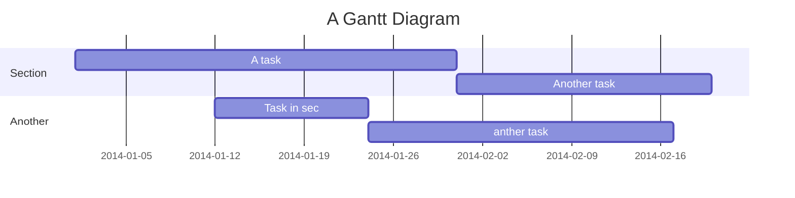

Project Title
===

## Table of Contents

[TOC]

## System Overview

The Operational Management System (OMS) is a media management platform that controls, monitors, and surfaces media fulfillment data. The OMS enables users to monitor the health of their business, analyze processes, and provide actionable insight via interactive and customizable visualizations.

Integrated with third party apps such as  SDVI Rally, Rightsline, and BeBanjo, the OMS combines both an order management system with extensible task management queues so that users have a unified view of supply chain data that leverages each core component/integration.

This tutorial teaches you OMS essentials as a new user. This QuickStart guide will show you:

-   how to log into OMS
-   how to set up roles and permissions for specific customers
-   how to create studios, brands and titles in Rightsline
-   OMS supply chain fundamentals
-   how to create OMS customer profiles
-   how to create a customer profile in the OMS
-   how to place and manage orders, jobs, and tasks in the OMS
-   how to navigate and manage your titles in File Manager
    
This QuickStart guide will also show you the OMS interface and the terminologies, naming and file conventions used in the platform, and additional workflows and use cases.

## Getting Started - Logging In

To complete this tutorial using this QuickStart guide, you need to have an Okta account.

Access to the OMS is enabled via Okta. All LADB users that have single sign-on authorization enabled and access requested should be able to view the OMS app in their LADB Okta apps list.

1.  Open a browser and log into your LADB Okta platform using your user credentials.
> **Note:** The following browsers are compatible with OMS:
>- **Fully supported:**
>--   Chrome: version 93.0.4577+
>--   Safari: version 15+
>--   Edge: version 93+
>- **Limited support:**
>-- Firefox

2.  Click OMS from the LADB Okta apps list.
3.  The OMS dashboard is displayed once single sign-on access is authorized.

## The OMS Browser and user interfaces

The OMS platform is comprised of five (5) main user interfaces:  

1.  The OMS Dashboard provides a high-level visualization of content orders, filterable by date month, in order for a user to identify actionable items and see business trends. Users can view order and delivery performance and navigate directly into orders in specific states.

2.  The Orders interface shows a list of content orders at a high level (with optional filters and saved searches). Along with an order’s status and progress, you can click into the Jobs that comprise the Order or edit the Order’s details.
    
> **Note:** An Order is a grouping of line-item jobs.

3.  The Jobs interface shows a list of actionable Jobs that users can navigate into.  
      
    > **Note:** The jobs are line items within an Order.

4. The Task Management module allows you to view specific types of Tasks comprised within a job.
    
**Pending Assets** – Tasks that require assets to be ingested against a SDVI-created shell record, or future use asset, so that the job can continue to the next processing state.

**Review Task** – Tasks that require video QC screening before it can be edited or delivered.

**Edit Tasks** – Tasks that require editing of a master source asset in Adobe Premiere. 
    
**Processing Exceptions** – Tasks that have incurred an error in the workflow and requires action by a user. 

5. File Manager is a user-friendly interface for users to manage content files without needing to gain access to direct storage (e.g. Amazon Web Services (AWS) S3 bucket). 

## Dashboard basics

The OMS Dashboard provides users an at-a-glance view of all orders and deliveries by Month. Users can view order and delivery performance, click into actionable items for orders in specific states, and download daily and weekly reports. 

Upon initial login to the OMS, the Month filter dropdown will default on “All Months”. To change this to a specific month, click on the dropdown arrow and select the month you would like to view Dashboard data for. 

In this example, the “March 2022” filter is selected. Note that counts will then shift and update in real-time. User is now viewing order statuses and deliveries for the March 2022 month: 

**Order Status Cards** 

The status card indicators at the top of the Dashboard allow users to view orders by the following statuses: 

* Awaiting Assets: Orders requests that are awaiting assets 
* Ready: Orders ready for processing 
* Processing: Orders processing in progress 
* Delivering: Orders in a ready for delivery or delivering state 
* Delivered: Completed jobs 

To view all orders for a specific state, click on the associated status card. Note that all orders are derived and aggregated from BeBanjo statuses. Refer to the BeBanjo developer documentation for more information about third-party app integrations. 

**Open Jobs Status** 

The Open Jobs Status provides users with a visualization of orders in the various states. Hovering over a state in the pie chart will display the percentage of orders in that state.  

In this example, we hover over the Awaiting Assets state to view that 46.9% of jobs are missing asset components to be worked on. 

**On-Time Delivery** 

The On-Time Delivery graph displays a comparison of deliveries over the past 6 months. In the image below, the comparison of on-time delivery is between the months of March and April 2022. 

**Media Delivery** 

The Media Delivery module is available when a Month is selected. It displays the percentage of the total media that has been delivered for the selected Month. It also displays the percentage delivered. 

In the example below, 13% of the media has been delivered so far, with 13% of the deliveries delivered on time.

# Roles and Permissions

OMS Roles and Permissions can be configured in Okta by a super administrator or an LADB user who has Okta OrgAdmin group permissions.  

Roles and Permissions help you manage Okta user groups, including their access to specific database of titles according to their Customer Profile type.  

In Okta, there are four user groups, with the user group definition based on the permission types on each OMS feature:  

|**Feature**   |**Permission Type**   |**Description**           |**OrgAdmin**** |**CustomerAdmin*** |**OrgViewer**** |**CustomerViewer*** |
|--------------|----------------------|--------------------------|-------------|------------------|--------------|-------------------|
|Dashboard     |Read                  |Able to view Dashboard    |      X       |         X         |       X       |         X          |     
|Orders        |Read                  |Able to view orders only (No Order placement or editing of information in an existing order)  |     X        |         X         |        X      |          X         |  
|              |Write                 |Able to view Orders and Edit Order information, Able to create new Orders (Order Placement)                   |       X      |         X         |        0      |          0         |
|Jobs          |Read                  |Able to view Jobs only           |      X       |         X         |      X        |         X          |
|              |Write                      |Able to view and edit job information (e.g. due dates)                   |       X      |       X           |       0       |          0         |
|Pending Assets        |Read                      |Able to view tasks awaiting assets, task information, and Notes only|      X       |     X             |       X       |          X         |
|              |Write                      |Able to view and edit Tasks awaiting assets (e.g. Assign Tasks, move statuses, add Notes)                   |       X      |          X        |      X        |          X         |
|Review Tasks        |Read                      |Able to view Tasks, task information, and Notes only                   |      X       |     X             |       X       |          X         |
|              |Write                      |Able to view and edit Tasks (e.g Assign Tasks, move statuses, add Notes)                  |       X      |        X          |       X       |         X          |
|Edit Tasks        |Read                      |Able to view Tasks, task information, and Notes only                   |       X      |       X           |       X       |        X           |
|                  |Write                      |Able to view and edit Tasks (e.g Assign Tasks, move statuses, add Notes)|      X       |     X             |      X        |         X          |
|Processing Exceptions        |Read                      |Able to view Tasks in Review status due to Task Failed |      X       |       X           |       X       |         X          |
|File Manager        |Read                      |Able to browse File Manager and view transfer queue only|     X        |           0       |       X       |         0          |
|       |Write                      |Able to browse, copy, and move files; Able to create new folders; Able to view the transfer queue                  |      X       |          0        |        X      |        0           |
|Profiles        |Read                      |Able to view Profiles only                   |      X       |         X         |         X     |          X         |
|                |Write                      |Able to view, edit, and create new profiles                   |       X      |       0           |       0       |          0         |


> *Limited to WRITE (create) or READ (Access/View) permission by the Customer Profile/s allocated to the LADB user.
> **Can READ/WRITE to any Customer


Refer to the following Okta documentation for steps on:

-   [Custom administrator roles](https://help.okta.com/en/prod/Content/Topics/Security/custom-admin-role/custom-admin-roles.htm) (or how to configure granular permissions within a role)
-   [Standard roles](https://help.okta.com/en/prod/Content/Topics/Security/custom-admin-role/use-standard-roles.htm)
-   [Users, groups, and profiles](https://help.okta.com/en/prod/Content/Topics/users-groups-profiles/usgp-main.htm)
-   [Guidance for structuring user groups](https://help.okta.com/en/prod/Content/Topics/Security/administrators-structure-groups.htm)
-   [Best practices for creating custom role assignments](https://help.okta.com/en/prod/Content/Topics/Security/custom-admin-role/best-practices-custom-admin-roles.htm)


## Create a new Okta user

> **Note:** You need to be a super administrator or an LADB user who has Okta OrgAdmin group permissions in order to do this.

Perform the following steps if you are providing OMS access and feature permissions for a new LADB user.

1.  In the Okta Admin Console, go to **Directory > People.**
2.  Click **Add Person**.
3.  Select a user type in the User type list or accept the default.
4.  Complete these fields:

- First name — Enter the user's first name.
- Last name — Enter the user's last name.
- Username — Enter the user's user name in email format.
- Primary email — Enter the user's primary email if it's different from their username.
- Secondary email — Optional. Enter a secondary email to allow the user to access information when their primary email is unavailable.
- Groups — Optional. Enter the groups to which the user belongs.
- Password — Select Set by user to allow the user to set their password, or select Set by admin and enter a password.
- Send user activation now - Optional. This check box is available when Set by user is selected as the password option. Select this check box to send a user activation email to the user.
- User must change password on first login — Optional. This check box is selected by default when you select Set by admin as the password option. Clear this check box if you do not want the user to change their password when they first sign in.
   
5.  Click Save or click Save and Add Another to add another user.

## API Docs

Access to the OMS and OMS API is enabled via Okta. When a user completes the SAML authorization, the user can now be able to access all available LADB Okta apps, including resources such as the OMS API.

The OMS API currently lives at ``api/v1/common/version.`` 

The URL is also an API endpoint to get details about the latest version of the deployed API using the following parameters: ``GET /api/v1/common/version/``

**Response class (200 OK)**
		Lists the current version of the OMS API
		

**Response content type**
		application/json

**Response Body**
        Version number.

**Response structure details (sample JSON):**
```
{
    "success": true,
    "message": "",
    "data": [
        "0.0.95",
        "a5ae12cf5d82d72077bcb8daba8dec0c85007e13"
    ]
}
```


User story
---

```gherkin=
Feature: Guess the word

  # The first example has two steps
  Scenario: Maker starts a game
    When the Maker starts a game
    Then the Maker waits for a Breaker to join

  # The second example has three steps
  Scenario: Breaker joins a game
    Given the Maker has started a game with the word "silky"
    When the Breaker joins the Maker's game
    Then the Breaker must guess a word with 5 characters
```
> I choose a lazy person to do a hard job. Because a lazy person will find an easy way to do it. [name=Bill Gates]


```gherkin=
Feature: Shopping Cart
  As a Shopper
  I want to put items in my shopping cart
  Because I want to manage items before I check out

  Scenario: User adds item to cart
    Given I'm a logged-in User
    When I go to the Item page
    And I click "Add item to cart"
    Then the quantity of items in my cart should go up
    And my subtotal should increment
    And the warehouse inventory should decrement
```

> Read more about Gherkin here: https://docs.cucumber.io/gherkin/reference/

User flows
---
```sequence
Alice->Bob: Hello Bob, how are you?
Note right of Bob: Bob thinks
Bob-->Alice: I am good thanks!
Note left of Alice: Alice responds
Alice->Bob: Where have you been?
```

> Read more about sequence-diagrams here: http://bramp.github.io/js-sequence-diagrams/

Project Timeline
---


> Read more about mermaid here: http://mermaid-js.github.io/mermaid/

## Appendix and FAQ

:::info
**Find this document incomplete?** Leave a comment!
:::

###### tags: `Templates` `Documentation`
